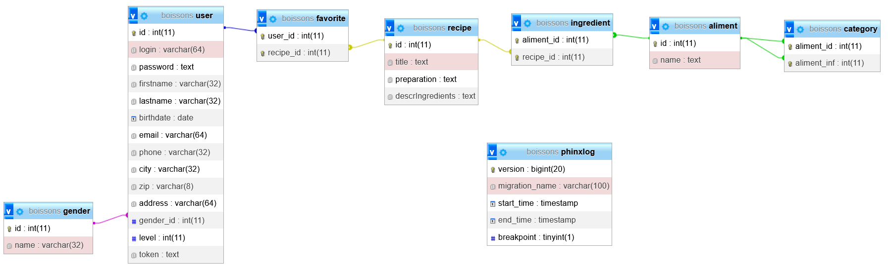

# Notre configuration
L'ensemble des instructions pour déployer ce projet est disponible dans le fichier [README.md](./README.md).

## Machines de développement
Sur nos machines, nous travaillons avec un environnement XAMPP.

## Serveur de production
Le serveur est hébergé sur un pc de type "barebone" chez un des membres du groupe.
Le nom de domaine est "[cocktails.projects.antoinectx.fr](https://cocktails.projects.antoinectx.fr)" (enregistré avec OVH) et le certificat SSL est délivré par Let's Encrypt (avec certbot).

Configuration du serveur :
 - Ubuntu Server 22.04.1 LTS
 - Apache 2.4.52
 - PHP 8.1.2
 - MariaDB 10.6.11

Le VirtualHost donné en exemple dans le fichier [README.md](./README.md) est celui utilisé sur le serveur.

# Technologies utilisées
## Back-end
 - PHP
   - [Composer](https://getcomposer.org/), pour la gestion des dépendances
   - [Eloquent](https://laravel.com/docs/8.x/eloquent), pour la gestion de la base de données
   - [Phinx](https://phinx.org/), pour la gestion des migrations
   - [Slim](https://www.slimframework.com/), pour la gestion des routes
 
Ces technologies ont toutes été étudiées et utilisées à l'IUT Nancy-Charlemagne, excepté Phinx (découvert en entreprise durant le stage d'un des membres du groupe).

## Front-end
```ini
TODO
```

# Analyse et solutions
## Stockage des données
### Base de données
Les données sont stockées dans une base de données MySQL/MariaDB. Le schéma de celle-ci est présenté ci-dessous.


La base de données est construite à partir des différentes migrations Phinx présentes dans le dossier [src/api/db/migrations](./src/api/db/migrations).
C'est ce qui nous a permis de partager la même structure de base de données entre les différents membres du groupe et de développer rapidement.
La modification de la base de données est donc très simple à appliquer. Il suffit d'appeler la commande `./vendor/bin/phinx migrate` dans le dossier [src/api](./src/api).
C'est donc ce qui explique la présence de la table `phinxlog` dans le schéma de la base de données ci-dessus.

Phinx a été choisi pour sa simplicité d'utilisation et sa facilité de mise en place.

Phinx :
 - [Site officiel](https://phinx.org/)
 - [Documentation](https://book.cakephp.org/phinx/0/en/index.html)

### Remplissage de la base de données
Le remplissage de la base de données ne peut être effectué que par un utilisateur ayant les droits d'administrateur.
Par défaut, l'utilisateur `admin` est créé avec le mot de passe `admin` lors de la création de la base de données.

La procédure est détaillée dans le fichier [README.md](./README.md).

Lors du remplissage, les tables `recipe`, `ingredient`, `aliment` et `category` sont remplis à partir du fichier [src/assets/Donnees.inc.php](./src/assets/Donnees.inc.php).
Ces tables sont vidées avant d'être remplies afin d'éviter les doublons.

## Recherche
Lors de la recherche d'un cocktail, l'utilisateur peut rechercher un nom, mais aussi filtrer par ingrédient.
### Front
```ini
TODO: parler de la hiérarchie des aliments, comment tu les récupères, comment tu les affiches, et comment tu donnes les résultats
```

### Back
Le front envoie une requête à l'API qui va récupérer les cocktails correspondants à la recherche de l'utilisateur.
La requête est composée du texte de recherche, des ingrédients obligatoires et des ingrédients interdits.

Étapes de la recherche (effectuées par l'API) :
 - On commence par récupérer qui contiennent au moins un mot de la recherche dans leur nom. 
 - On filtre pour ne garder que ceux qui contiennent tous les ingrédients obligatoires. 
 - On filtre pour ne garder que ceux qui ne contiennent aucun des ingrédients interdits.

Les résultats sont triés de la manière suivante avec un calcul de score :
 - Pour chaque mot de la recherche, +1 si le nom du cocktail contient le mot ;
 - Pour chaque mot de la recherche, +1 si un ingrédient du cocktail contient le mot ;
 - Pour chaque mot de la recherche, on divise les points pour ce mot par 2 si le mot est entre parenthèses.

## Formulaires

## Favoris

## Connexion