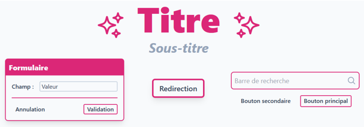

Réalisé par Antoine CONTOUX et Paul LOISIL.

# Notre configuration
L'ensemble des instructions pour déployer ce projet est disponible dans le fichier [README.md](./README.md).

## Machines de développement
Sur nos machines, nous travaillons avec un environnement XAMPP (version 3.3.0).

## Serveur de production
Le serveur est hébergé sur un pc de type "barebone" chez un des membres du groupe.
Le nom de domaine est "[cocktails.projects.antoinectx.fr](https://cocktails.projects.antoinectx.fr)" (enregistré avec OVH) et le certificat SSL est délivré par Let's Encrypt (avec certbot).

Configuration du serveur :
 - Ubuntu Server 22.04.1 LTS
 - Apache 2.4.52
 - PHP 8.1.2
 - MariaDB 10.6.11

Le VirtualHost donné en exemple dans le fichier [README.md](./README.md) est celui utilisé sur le serveur.

# Technologies utilisées
## Back-end
 - PHP
   - [Composer](https://getcomposer.org/), pour la gestion des dépendances
   - [Eloquent](https://laravel.com/docs/8.x/eloquent), pour la gestion de la base de données
   - [Phinx](https://phinx.org/), pour la gestion des migrations
   - [Slim](https://www.slimframework.com/), pour la gestion des routes
 
Ces technologies ont toutes été étudiées et utilisées à l'IUT Nancy-Charlemagne, excepté Phinx (découvert en entreprise durant le stage d'un des membres du groupe).

## Front-end
  - HTML, pour la structure
  - CSS, pour le style
  - JavaScript, pour la logique de l'application
  - [TailwindCSS](https://tailwindcss.com/), pour le style

Ces technologies ont toutes été étudiées et utilisées à l'IUT Nancy-Charlemagne, à l'exception de TailwindCSS (découvert en entreprise durant le stage).
L'utilisation de VueJS a été envisagée, mais nous avons jugé le gain de temps que cela nous procurerais trop faible pour justifier son installation.

# Analyse et solutions
## Stockage des données
### Base de données
Les données sont stockées dans une base de données MySQL/MariaDB. Le schéma de celle-ci est présenté ci-dessous.

La base de données est construite à partir des différentes migrations Phinx présentes dans le dossier [src/api/db/migrations](./src/api/db/migrations).
C'est ce qui nous a permis de partager la même structure de base de données entre les différents membres du groupe et de développer rapidement.
C'est donc ce qui explique la présence de la table `phinxlog` dans le schéma de la base de données ci-dessus.

### Remplissage de la base de données
Le remplissage de la base de données ne peut être effectué que par un utilisateur ayant les droits d'administrateur.
Il faut que la procédure d'insertion des données dans la base de données soit simple et rapide.
Pour cela, nous avons choisi de la laisser à la charge de l'administrateur, depuis l'interface web.

**La procédure est détaillée dans le fichier [README.md](./README.md).**

Lors du remplissage, les tables `recipe`, `ingredient`, `aliment` et `category` sont remplis à partir du fichier [src/assets/Donnees.inc.php](./src/assets/Donnees.inc.php).
Ces tables sont vidées avant remplissage afin d'éviter les doublons.

## Interface
### Front
Pour l'interface nous avons choisi des composants et un style graphique simple mais efficace.
Une seule couleur est utilisée pour la majorité des éléments, ce qui permet de garder une cohérence visuelle : Le rose foncé (code couleur `#db2777`)
Le style graphique est basé sur le framework [TailwindCSS](https://tailwindcss.com/), qui permet de créer des interfaces web rapidement et efficacement.

Certains éléments clés ont donc le même style sur toutes les pages du site web:

## Recherche
Lors de la recherche d'un cocktail, l'utilisateur peut rechercher un nom, mais aussi filtrer par ingrédient.
### Front
La recherche de aliments dans le site web est représentée par deux éléments principaux:
- La barre de recherche: Permet de rechercher un nom de cocktail.
- Les filtres aliments: Permettent de filtrer les résultats par aliments présents ou absents dans les cocktails.

Nous avons opté pour deux moyens différents d'afficher les résultats:
- Une barre d'auto-complétion: Permet de compléter le nom d'un cocktail en cours de saisie.
- Une liste de résultats: Affiche les cocktails correspondant à la recherche sous forme de tuiles.

Ces deux moyens d'affichages permettent à la fois d'avoir une selection rapide des cocktails (avec la barre) ou alors une liste complète des cocktails correspondant à la recherche, avec une photo de présentation (avec la liste).

La représentation des aliments nous a pris un certain temps a mettre en place, car il a fallu développer un système de menu/sous-menu pour afficher les aliments de manière hiérarchique, ainsi que pouvoir en sélectionner plusieurs et dire s'ils étaient voulu ou non dans les cocktails.

### Back
Le front envoie une requête à l'API qui va récupérer les cocktails correspondants à la recherche de l'utilisateur.
La requête est composée du texte de recherche, des ingrédients obligatoires et des ingrédients interdits.

Étapes de la recherche (effectuées par l'API) :
 - On commence par récupérer qui contiennent au moins un mot de la recherche dans leur nom. 
 - On filtre pour ne garder que ceux qui contiennent tous les ingrédients obligatoires. 
 - On filtre pour ne garder que ceux qui ne contiennent aucun des ingrédients interdits.

Les résultats sont triés de la manière suivante avec un calcul de score :
 - Pour chaque mot de la recherche, +1 si le nom du cocktail contient le mot ;
 - Pour chaque mot de la recherche, +1 si un ingrédient du cocktail contient le mot ;
 - Pour chaque mot de la recherche, on divise les points pour ce mot par 2 si le mot est entre parenthèses.

## Formulaires
### Front
Les formulaires classiques n'ont pas été utilisés, car nous avons préféré refaire des formulaires personnalisés et les rendre interactifs en utilisant du Javascript.
Cela nous permet donc d'afficher les erreurs directement dans le formulaire, sans avoir à recharger la page ou de mettre des paramètres supplémentaires dans les requetes (comme le token utilisateur dans les headers).

### Back
Les formulaires de connexion et d'inscription sont gérés par l'API.
L'API vérifie que les données envoyées par le front sont valides et renvoie une erreur si ce n'est pas le cas.
Le détail des vérifications est présenté dans le fichier [routes.md](./conception/routes.md).
Nous sommes assez stricts sur le mot de passe, car nous ne voulons pas que les utilisateurs puissent se connecter avec un mot de passe trop simple.
Les paramètres optionnels vides sont ignorés. En revanche, les paramètres obligatoires vides sont considérés comme invalides.

Chaque vérification produit un message d'erreur différent, ce message est ensuite affiché par le front.
Les messages renvoyés par l'API peuvent être traduits en plusieurs langues. Nous avons travaillé au départ en anglais, mais nous avons décidé de traduire en français car le front est en français.

## Favoris
### Front
Deux systèmes de favoris ont été mis en place:
- Favoris locals: Les favoris sont stockés dans le navigateur de l'utilisateur. Ils sont donc accessibles uniquement depuis le navigateur utilisé pour les ajouter.
- Favoris serveur: Les favoris sont stockés sur le serveur quand l'utilisateur est connecté à son compte. Ils sont donc accessibles depuis n'importe quel navigateur sous le même compte.

UNn problème s'est posé lors de la mise en place des favoris serveur: Comment synchroniser les favoris locals des l'appareils de l'utilisateur au moment de la création d'un compte ?
Pour cela, nous avons opté pour une fenetre modale qui s'affiche au moment de la création du compte, et qui demande à l'utilisateur s'il souhaite synchroniser ses favoris locaux avec son nouveau compte.

### Back
L'API permet d'ajouter ou de supprimer de l'utilisateur courant une liste de cocktails en favoris.
L'API vérifie seulement que l'id du cocktail est valide et que l'utilisateur est connecté.
Il est possible de donner plusieurs fois le même id de cocktail ou de supprimer un cocktail qui n'est pas en favoris.

## Connexion
### Front
La création et la connexion à un compte sont gérées par l'API, le site web ne fais office que d'un terface pour récupérer les champs saisi et envoyer les données.
Aucune vérification poussée des champs n'est faite, car l'API s'en charge. Le site web ne fait que récupérer les erreurs depuis l'API si un champ est mal rempli et afficher l'erreur à l'utilisateur.
Les formulaires personnalisés sont utilisés pour la connexion et l'inscription, une requete est donc faite avec la classe API.js pour ces deux fonctionnalités.

### Back
Lors de la connexion ou de l'inscription, si les champs sont valides, l'API renvoie le token de l'utilisateur.
C'est ce qui permet de ne pas avoir à se reconnecter à chaque fois que l'on envoie une requête à l'API ou à garder en mémoire le mot de passe.

En prenant Discord comme exemple, nous avons décidé de changer le token lors du changement de mot de passe. Cela permet de renforcer la sécurité de l'application, car si quelqu'un a accès au token de l'utilisateur, il ne pourra plus se connecter après un changement de mot de passe.